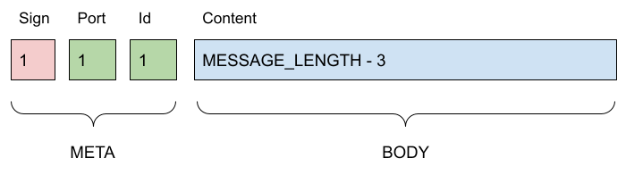

CommoTalkie 
===========

* [Message](#message)
    + [Signature](#signature)
    + [Port](#port)
    + [Id](#id)
    + [Content](#content)
* [SDK](#sdk)
    + [Publish](#publish)
    + [Pull](#pull)
    + [Builders make it easier](#builders-make-it-easier)
        - [Publish Builder](#publish-builder)
        - [Pull Builder](#pull-builder)
* [Testing](#testing)
* [Driver integration](#driver-integration)
    + [EByte Driver example](#ebyte-driver-example)
        - [Create a Driver instance](#create-a-driver-instance)
        - [Send with a Driver instance](#send-with-a-driver-instance)
        - [Receive with a Driver instance](#receive-with-a-driver-instance)
    + [Support for Power Management Unit](#support-for-power-management-unit)
    + [CommoTalkino Full integration example](#commotalkino-full-integration-example)
* [Arduino](#arduino)
* [License](#license)
* [Author](#author)

Communication interface for low power consumption devices.
"Keep it tiny" is one of the most important requirements of this project.

In addition, an EByte integration library only for this project's required use 
cases.

## Message ##

This communication pipeline validates, encrypts and transports the following 
Message structure.



MESSAGE_LENGTH value is a configuration parameter of "messageconfig.h" and it is
the total length of the message, META and BODY together. A length change must 
consider the pragma alignment configuration of 4 set in 
[./include/message/Message.h](./include/message/Message.h)

### Signature ###

The most significant byte is the sign to validate the next message bytes. This 
byte is automatically set during the publication of a message.

### Port ###

The second most significant byte is for feature segregation in the receiver.

### Id ###

The third most significant byte purpose is an Id.

### Content ###

The data to be transported.

## SDK ##

Publisher and subscriber clients.

See [./include/application](./include/application) for the concrete interface
and [./test](./test) for more implementation details.

### Publish ###

This publisher sends a message towards a "topic". A topic is an address, event 
name, just a message destination.

```c
// My Device Id
const unsigned char my_id = 0x06;
unsigned char body[MESSAGE_BODY_LENGTH];

// Initialize publisher
Publish_Create("salt", (const void *) push_fn);

// A port for the commotalkie context backend is as an endpoint for an HTTP API
const unsigned char port_for_temperature = 0x05;

// Send a message
Publish_Invoke((const unsigned char *)"destination::address", port_for_temperature, my_id, "a message");

// Send other message to a different port
Publish_Invoke((const unsigned char *)"destination::address", 0xAD, my_id, "another message");

// Send other message to another destination
Publish_Invoke((const unsigned char *)"another::destination", 0xAD, my_id, "and another message");

// Destroy
Publish_Destroy();
```

The `push_fn` function is a function with an implementation of the message 
submission using the kind of communication as your choice: LoRa, Wi-Fi, 
Bluetooth,...

Following that's the signature of the submission function. The maximum allowed 
size of the content is always the value of the constant `MESSAGE_LENGTH`. 
Address is just the place for the mentioned message destination (topic).

```c
unsigned long push_fn(const unsigned char* address, const unsigned char* content, unsigned long size);
```

### Pull ###

This subscriber listens for a message in its "topic" only, until a valid message 
is received or timeout expires. Timeout parameter as 0 disables the expiration.

```c
// Initialize the content destination variables
const unsigned long timeout_milliseconds = 10 * 1000;
const unsigned char to_id = 0xAA;

// Initialize pulling messages to ID 0xAA only
Pull_Create(
    "salt",
    (void *) listen_fn,
    (void *) now_fn,
    timeout_milliseconds,
    &to_id
);

// Start listening for messages sent to "destination::address" only
unsigned char body[MESSAGE_BODY_LENGTH];
unsigned char port, id;
result = Pull_Invoke((const unsigned char *)"destination::address", &port, &id, body);

// Do some stuff with the message contents
something(body);

// Destroy after first message
Pull_Destroy();
```

The option `to_id` validates the messages sent to the given ID only. If this
parameter value is 0x00, the pulling does validate a message sent to any ID.
Initialization example for wildcard ID:

```c
Pull_Create(
    "salt",
    (const void *) listen_fn,
    (const void *) now_fn,
    (const void *) turn_on_fn,
    (const void *) turn_off_fn,
    timeout_at,
    0x00
);
```

There is a salt value in the first argument.

The `timeout_at` argument value is the listening expiration time. The unit for
this value depends on the value returned by the time service `now_fn`. If the 
`timeout_at` value is 0, there is no timeout and the device is listening
permanently.

The last argument is an ID to make the listener selective. If a received message
is not forwarded to this ID, the message is discarded.

The remaining arguments are the following function:

* Listen for a message whatever port or device the implementation uses.
* A time service providing a time in a number type value.
* A command function to turn on the listener.
* A command function to turn off the listener.

The listening function listens for a message input from whatever communication 
device is provided in the integration, fills up the `buffer` with and 
returns one of the following integer values:

* 1 on success.
* 0 when it did receive nothing.
* -1 on error.

The listening function has the following signature. The `size` argument
is exactly the value of MESSAGE_LENGTH. If the transporter driver prepends or 
appends bytes to the message for technical requirements, the `listen_fn` fills
up the `buffer` argument with the content without the transporter additions.

```c
int listen_fn(const unsigned char* address, unsigned char* buffer, const unsigned long size);
```

The time service function signature is pretty simple, it's just a call to a 
clock to get an increasing number of milliseconds:

```c
unsigned long now_fn();
```

The signature for the `turn_on_fn` is as follows:

```c
void turn_on_fn();
```

The signature for the `turn_off_fn` is as follows:

```c
void turn_off_fn();
```

The listener is turned off by default and turned on for listening during the 
window limited by the timeout only.

### Builders make it easier ###

A builder for Pull and Publish instances makes their implementation easier and
safer. Using the following examples to create the instances is highly 
recommended.

More examples here:
* Tests for Publisher Builder [./test/PublisherBuilderTest.cpp](./test/PublisherBuilderTest.cpp)
* Tests for Pull Builder [./test/SubscriberBuilderTest.cpp](./test/SubscriberBuilderTest.cpp)

#### Publish Builder ####

The result of `PublisherBuilder_Build()` is 1 or 0 for success or error
respectively. Salt and sending callback are required.

Create an instance of Publish and use it as follows:
```c
PublisherBuilder_Create();
PublisherBuilder_SetSalt(salt);
PublisherBuilder_SetSendCallback(push_fn);
if (!PublisherBuilder_Build()) exit(-1);
PublisherBuilder_Destroy();

Publish_Invoke((const unsigned char*)"destination::address:1", 0x05, 0x06, body);
Publish_Invoke((const unsigned char*)"destination::address:2", 0x06, 0x06, body);
Publish_Invoke((const unsigned char*)"destination::address:3", 0x07, 0x06, body);

// Destroy if you need it no more.
Publish_Destroy();
```

#### Pull Builder ####

The result of `SubscriberBuilder_Build()` is 1 or 0 for success or error 
respectively. Salt and listening callback are required.

Create an instance of Pull and use it as follows:
```c
SubscriberBuilder_Create();
SubscriberBuilder_SetSalt("salt");
SubscriberBuilder_SetListenCallback(listen_fn);
SubscriberBuilder_SetReceiverStateCallback(turn_on_fn, turn_off_fn);
SubscriberBuilder_SetId(&id);
if (!SubscriberBuilder_Build()) exit(-1);
SubscriberBuilder_Destroy();

Pull_Invoke((const unsigned char*)"destination::address", &port, &id, body);
Pull_Invoke((const unsigned char*)"destination::address", &port, &id, body);
Pull_Invoke((const unsigned char*)"destination::address", &port, &id, body);

// Destroy if you need it no more.
Pull_Destroy();
```

## Testing ##

Testing directory [./test](./test) is the best documentation stuff of this 
project. There are test scenarios for all components separately and together 
injected into a use case.

It is created from TDD based on the book "Test-Driven Development for Embedded C"
written by the great [James W. Grenning](https://wingman-sw.com/).

The tests are handled by the library [CppUTest](https://cpputest.github.io/),
also following the guidelines from the book mentioned above and the documentation
in the official page of the library.

The following environment variables has to 

## Driver integration ##

The publishing and pulling use cases have some dependencies. Many of them 
depend on a real communication device: bluetooth, Wi-fi, LoRa,...

Following the low power is better directive, I'm focused on LoRa technologies
for this context. And I integrated an EByte transmitter module via Driver 
interface. See [include/driver/Driver.h](include/driver/Driver.h) and its unit 
test groups.

The [src/driver/EByteDriver.c](src/driver/EByteDriver.c) integration keeps the
power consumption as low as possible. It supports a few parameterized features
like air data rate, transmission mode and transmission power. It keeps the
device is sleep mode by default and only moves to active state for sending or
receiving messages.

### EByte Driver example ###

See the following examples about how to use the EByte integration Driver.

#### Create a Driver instance ####

```c

Timer timer = Timer_Create((const void *)stub_progressive_epoch_ms_fn);
unsigned long default_timeouts[2];
default_timeouts[MODE_TIMEOUT_INDEX] = 5 * 1000;
default_timeouts[SERIAL_TIMEOUT_INDEX] = 2 * 1000;

PinMap pins;
RadioParams params;
IOCallback io;

pins.m0 = 1;
pins.m1 = 2;
pins.aux = 3;
params.address[0] = topic[DRIVER_ADDRESS_HIGH_INDEX];
params.address[1] = topic[DRIVER_ADDRESS_LOW_INDEX];
params.channel = topic[2];
params.air_data_rate = air_data_rate;
params.is_fixed_transmission = is_fixed;
params.full_transmission_power = full_power;
io.read_pin = read_pin;
io.write_pin = write_pin;
io.write_to_serial = write_to_serial;
io.read_from_serial = read_from_serial;
io.clear_serial = clear_serial;

Driver_Create(pins, &params, &io, &timer, default_timeouts);
```

The time service function signature for `now_fn()` is just the same of the mentioned in the
Pull use case above.

First value in `default_timeouts` defines the number of time units, milliseconds 
in this example, to wait until expiration for AUX getting high again after 
changing the EByte switch mode. And the second `default_timeouts` value is the 
same for the serial transmission. Both, the switching mode and the serial
transmission usually spend a few milliseconds to get AUX high again, so this
timeout is rarely reached. Although, if any of these timeouts expire, the Driver
instance gets _WARNING_ as state. The _WARNING_ state does not block a feature, 
it's informative only and it can be changed next time the switching mode is
requested.

PinMap defines the UART EByte module to MCU device pinout relationship. In the 
example above, the pin M0 of the EByte module is connected to the MCU pin #1,
and so on.

The `IOCallback` method signatures are clearly defined in its definition:

```c
typedef struct IOCallback {
  int (*read_pin)(unsigned char);
  void (*write_pin)(unsigned char, unsigned char);
  unsigned long (*write_to_serial)(unsigned char *, unsigned long);
  unsigned long (*read_from_serial)(unsigned char *, unsigned long, unsigned long);
  void (*clear_serial)();
} IOCallback;
```

#### Send with a Driver instance ####

Once the Driver instance is created by the example above, it follows up with a 
string submission.

```c
const unsigned char raw_message[] = "abcdefghi";
Destination target;
target.address_high = 0xA1;
target.address_low = 0xA2;
target.channel = 0xA3;
unsigned long written =
  Driver_Send(&sample_driver, &target, raw_message, sizeof(raw_message));
```

In the example above, `written` gets the number of bytes sent.

#### Receive with a Driver instance ####

Once the Driver instance is created, let it listen to messages from other LoRa 
devices.

```c
unsigned char buffer[8];
int result = Driver_Receive(&sample_driver, buffer, sizeof(buffer));
```

EByte Driver instance listens the transmission until one of the next conditions
is met:

* The EByte module AUX pin gets high, according to [its documentation](doc/E32-915T20D_Usermanual_EN_v1.6.pdf). 
* The received content fills up the given buffer.
* The Serial timeout mentioned above expires, and it sets Driver instance state as _WARNING_.

### Support for Power Management Unit ###

There is also an interface implementation here [include/sleepable](include/sleepable)
for an external project of a [Power Management Unit for an unstable supply](https://github.com/westial/powermanagementunit).

### CommoTalkino Full integration example ###

[https://github.com/westial/commotalkino](https://github.com/westial/commotalkino)
is an example of this SDK and EByte driver integration. That project 
consists on permanently sending and receiving a number that is getting incremented
every transmission between a pair of Arduino MCU.

It pretends to be a funny virtual ping pong match but indeed it's a hard
stress test to check the stability and reliability of this whole communication 
project (uahaha!).

## Arduino ##

There is an Arduino library based implementation in [./arduino](./arduino).

To build the files for this Arduino library, go to this directory and execute
`make`. It creates a subdirectory in [./arduino/prebuild](./arduino/prebuild)
with the directory of the library itself [./arduino/prebuild/CommoTalkie](./arduino/prebuild/CommoTalkie)

To install the library move the [./arduino/prebuild/CommoTalkie](./arduino/prebuild/CommoTalkie)
to your OS Arduino Library 
[./arduino/prebuild/CommoTalkie/messageconfig.h](./arduino/prebuild/CommoTalkie/messageconfig.h) 
to the project you want to use this library in.

## License ##

GNU General Public License (GPLv3). Read the attached [license file](LICENSE.txt).

## Author ##

Jaume Mila Bea <jaume@westial.com>
